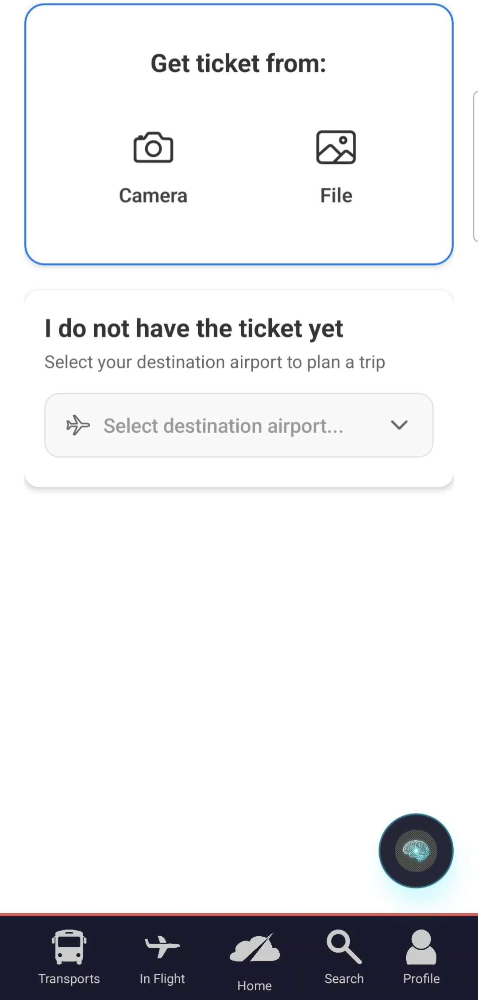
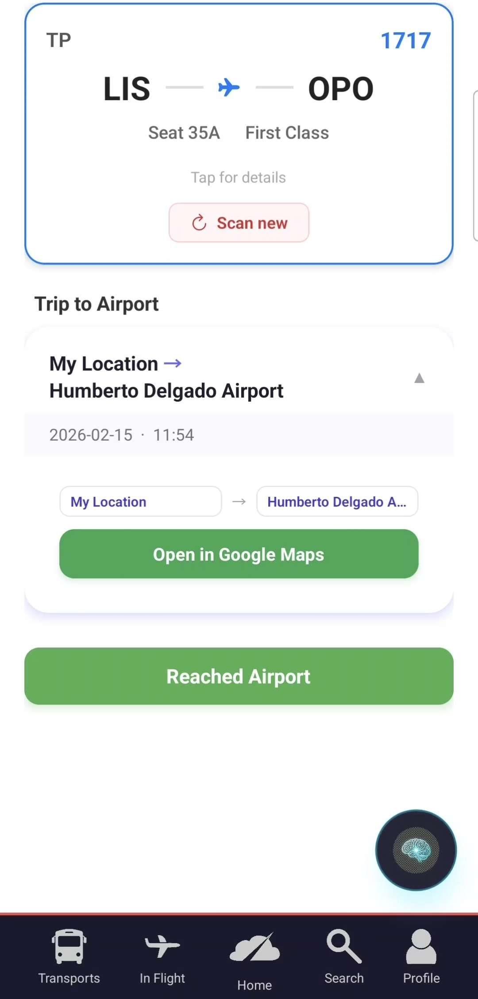
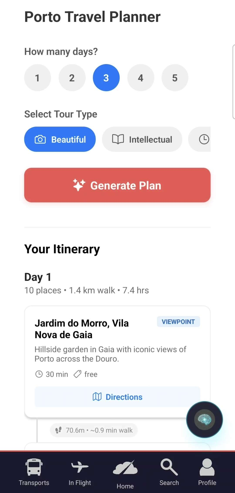

# ✈️ BugsByte2026 - Flight Companion


**Flight Companion** is a comprehensive mobile application designed to transform the travel experience. From the moment you step into the airport to your final destination, this app serves as your intelligent personal assistant, providing real-time flight updates, smart itinerary planning, and essential information whenever you need it.

---

## Overview

Traveling can be stressful—navigating airports, tracking flight changes, and planning transport in a new city. **Flight Companion** solves this by consolidating all your travel needs into one seamless interface. Features like **real-time flight tracking**, **automated ticket parsing**, and an **offline-capable AI chatbot** ensure you are never lost, even without an internet connection at 30,000 feet.

## 📸 Screenshots

<p align="center">
  <!-- Replace with actual screenshots -->
  
  
  
</p>

## Key Features

### Real-Time Flight Tracking
Stay updated with live information about your flight.
- **Live Status:** Receive instant updates on delays, gate changes, and boarding times.
- **Airport Insights:** Get detailed information about amenities and weather at your departure and arrival airports.

### Smart Ticket Parsing
Forget manually entering details.
- **Scan & Go:** Simply scan your boarding pass (QR or Barcode) to automatically import all your flight details.
- **Digital Wallet:** Keep all your tickets in one secure, easily accessible place.

### Hybrid AI Assistant
Your personal travel concierge, powered by advanced AI.
- **Online & Offline:** While connected, enjoy full conversational capabilities. In the air? Access cached essential info and flight details without needing WiFi.
- **Context-Aware:** The AI understands your specific itinerary and can answer questions like "What's my gate?" or "How long until I land?"

### Tourist & Transport Planner
Explore your destination like a local.
- **City Guides:** customized itineraries for key destinations (e.g., Porto).
- **Public Transport Integration:** Determine the best routes to your hotel or next adventure with integrated transport schedules.

---

## Technology Stack

We leverage a robust, modern tech stack to ensure performance and reliability.

### **Frontend (Mobile App)**
- **Framework:** [React Native](https://reactnative.dev/) with [Expo](https://expo.dev/)
- **Language:** TypeScript
- **Storage:** Async Storage for offline persistence
- **Maps:** Native Maps integration

### **Backend (API & Logic)**
- **Framework:** [FastAPI](https://fastapi.tiangolo.com/) (Python)
- **Data Processing:** Pandas, NumPy
- **Web Scraping:** BeautifulSoup4 (for retrieving real-time airport/flight data)
- **Database:** SQLite
- **Testing:** Pytest

## 🔮 Future Roadmap

- [ ] **Global Flight API Integration**: Connect with FlightAware or AviationStack for worldwide real-time data.
- [ ] **Social Sharing**: Allow users to share live itineraries with friends and family.
- [ ] **Multi-Language Support**: Expand accessibility for international travelers.
- [ ] **Wearable App**: Companion app for smartwatches to show gate and boarding info at a glance.

---

## 👥 The Team

Flight Companion was created by:

- **[Herculano-Esteves](https://github.com/Herculano-Esteves)** - *Team Leader & Full Stack Developer*
- **[Arqueiro-Magico](https://github.com/Arqueiro-Magico)** - *Frontend Developer*
- **[Pergih](https://github.com/Pergih)** - *Backend Developer*
- **[PatoST](https://github.com/PatoST)** - *Backend Developer*

---

## Getting Started

Follow these instructions to set up the project locally.

### Prerequisites
- **Node.js** & **npm**
- **Python 3.9+**
- **Expo Go** app on your mobile device (optional, for testing)

### 1. Clone the Repository
```bash
git clone https://github.com/Herculano-Esteves/bugsbyte2026.git
cd bugsbyte2026
```

### 2. Backend Setup
The backend handles data parsing, storage, and API requests.

```bash
cd backend

# Create a virtual environment
python3 -m venv .venv

# Activate the virtual environment
# On Linux/MacOS:
source .venv/bin/activate
# On Windows:
# .venv\Scripts\activate

# Install dependencies
pip install -r requirements.txt

# Run the server
uvicorn main:app --host 0.0.0.0 --port 8000 --reload
```
*Note: The server will be accessible at `http://<YOUR_LOCAL_IP>:8000`.*

### 3. Frontend Setup
The mobile application interface.

```bash
cd frontend/flight-companion

# Install dependencies
npm install

# Start the Expo development server
npx expo start
```
Scan the QR code with the **Expo Go** app (Android/iOS) to run the app on your phone, or press `a` to run on an Android Emulator.

---

## License

This project is licensed under the **Apache License 2.0** - see the [LICENSE](LICENSE) file for details.